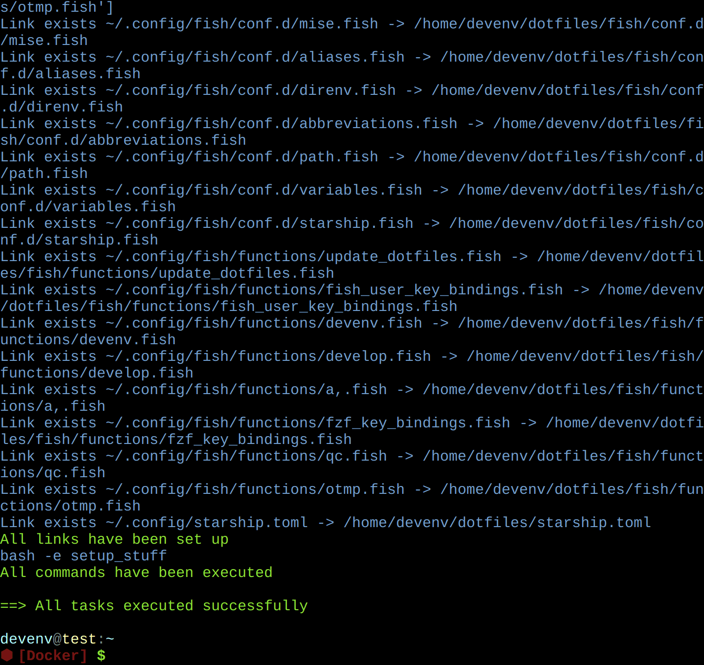

# dotfiles

- [**GitHub Repo**](https://github.com/dtinth/dotfiles)

## My shell setup

My shell setup is [continually tested](https://github.com/dtinth/dotfiles/blob/master/example-updater/test.js) using [shell-tester](https://docs.dt.in.th/shell-tester/index.html) on [GitHub Actions](https://github.com/dtinth/dotfiles/blob/master/.github/workflows/test.yml). The example images you see on this page are [generated from the test output](https://github.com/dtinth/dotfiles/blob/master/example-updater/update.js). Click on each image to see a text representation of the image.

### Shell prompt (Starship)

The [Fish Shell](https://fishshell.com/) prompt is powered by [Starship](https://starship.rs/).

### Fuzzy finder (fzf)

[fzf](https://github.com/junegunn/fzf) provides a fuzzy finder for the shell. Activate by pressing ++ctrl+r++

## Updating

Running `update_dotfiles` command in the Fish shell will update all dotfiles from the GitHub repository.

