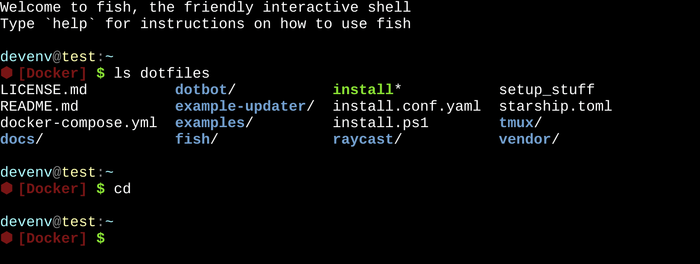
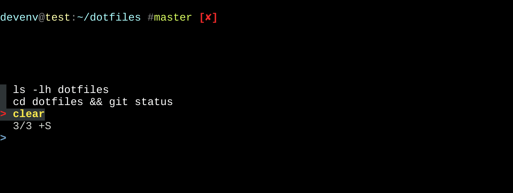

= My shell setup
:toc:

The example images in this document are automatically generated by link:../example-updater/test.js[example-updater/test.js]. Click on each image to see a text representation of the image.

== Shell prompt (Starship)

The https://fishshell.com/[Fish Shell] prompt is powered by https://starship.rs/[Starship].

== Fuzzy finder (fzf)

https://github.com/junegunn/fzf[fzf] provides a fuzzy finder for the shell.

